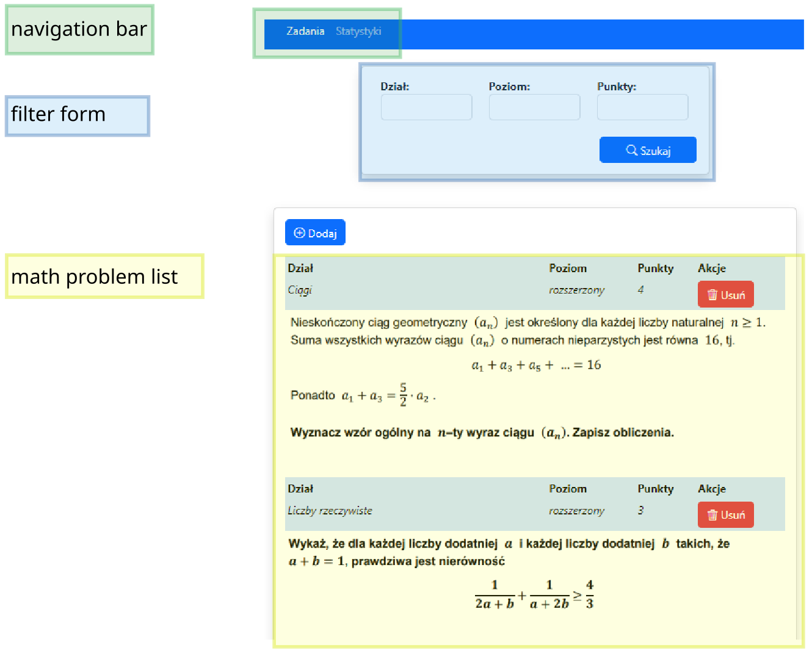
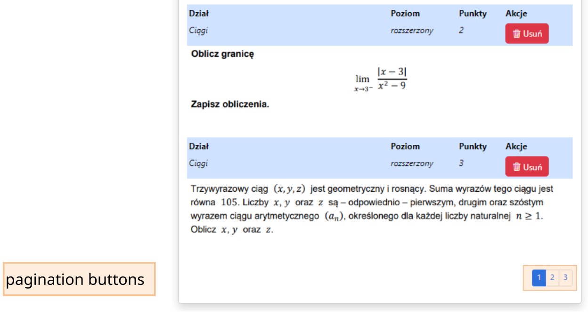
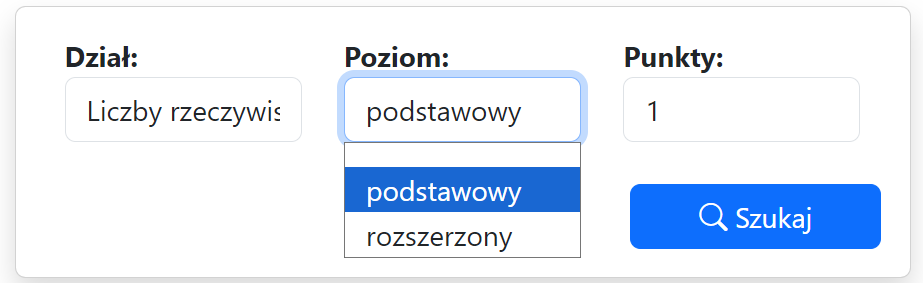
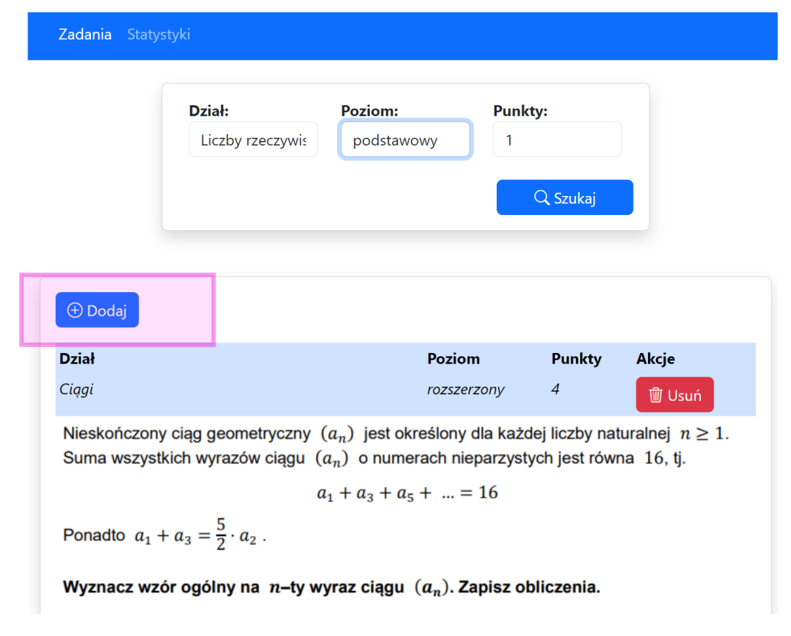
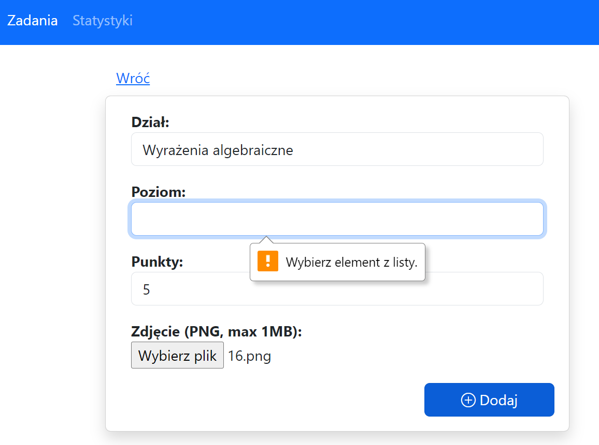
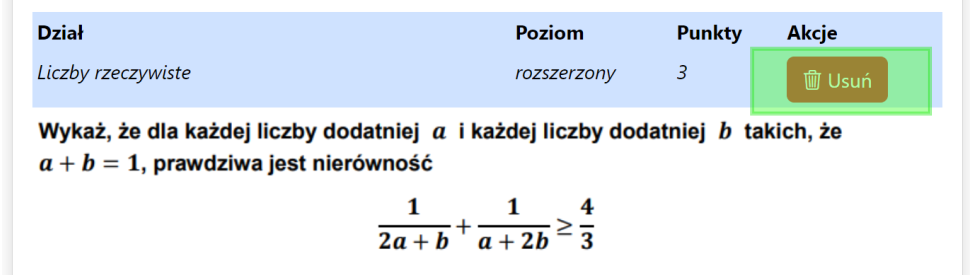
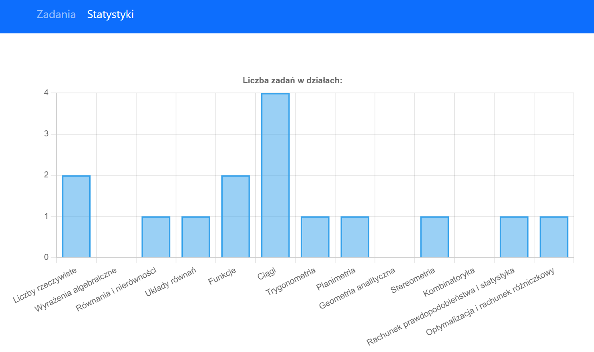

# Mathematical problems app
**Author: Marek Pędrys**

---

## Table of contents
* [General info](#general-info)
* [Technologies](#technologies)
* [User manual](#user-manual)
* [Local launch](#local-launch)

## General info
This project is a simple web application that provides users with a convenient mechanism for collecting, organizing and viewing mathematical problems.

## Technologies
Project is created with:
* Java
* Spring Boot
* Thymeleaf
* PostgreSQL

## User manual
The application is publicly available on: https://marek-pedrys.up.railway.app and does not require login.

By default, the "Zadania" tab opens:

If the number of math problems to display exceeds 5, pagination buttons appear at the bottom of the page:

Users can filter math problems by "department" or "level" or "points":

It is possible to open the form for creating a new math problem by clicking the "Dodaj" button:

All fields in the new math problem creation form are required. A math problem image in PNG format and size up to 1MB is required.

You can delete a math problem by clicking the "Usuń" button in "Zadania" tab:

In the "Statystyki" tab there is a chart presenting the number of math problems in departments:

## Local launch

To run the application locally:
<ol>
<li>
Download the code from the repository.
</li>
<li>
Uncomment <strong>@PropertySource("classpath:db-postgres.properties")</strong> in the <strong>MathematicalProblemsApplication class</strong>.
</li>
<li>
Provide access to the PostgreSQL database in the <strong>db-postgres.properties</strong> file (by overwriting the <strong>db-postgres-template.properties</strong> file).
</li>
<li>
Use e.g. Intellij IDE  to run the application.
</li>
</ol>
